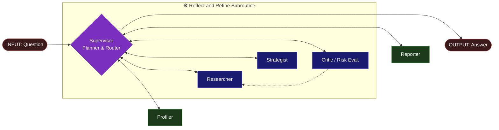

# 🤖 AI leveraged Financial Advisoring (DEMO) 

**A multi-agent investment advisor that watch you from blast your money 😉.**


> Most "AI financial advisor" demos will happily tell you how to get rich quick. This one is designed to tell you what **could fit** your ambitions. \
> It shows how turns a vague request like *"i want to invest my money..."* into an honest, diversified, risk-aware proposal is possible, without falling in the observed "optimistic" behaviour showed by other system demos, with "refusing to promise what markets can't deliver" as a one of reasoning pillars.

---

## 💡 Project goal

The project is focused on devising and implementing a LangGraph system of five specialist agents that collaborate to build an investment proposal from scratch, starting from a (not always well defined) plain text request: defining the investor profile, researching live markets, constructing an allocation, **critiquing its own work**, and writing it up in plain language.

This demo has a dual didactic purpose: both for financial education and agentic system development. 

From a strictly financial perspective this demo aims to produce answers near to textbook solutions for simple portfolio managment tasks. This choice has been made volountary in order to provide a sufficient starting point for building up a strong, non-quantitative, advising system.

Focusing on agentic system development, this project has the purpose of devising a multi-agent systems which leverages most relevant modern AI agents features as **CoT reasoning, ReAct thought/action/observation paradigm, external tools use capability and RAG architecture**, equiped with **persistent memory** to allow traceability and reproducibility.  

Despite the complexity of the goal, the agents network is freely designed to be easily understandable both by new learners and AI experts. 

---

## ⭐ Architecture



Under the hood the system flow is orchestrated by a **central supervisor in a hub-and-spoke topology**: every agent reports back to the supervisor, which inspects the shared state and decides who runs next. New behavior is a routing change, not a rewire. 

The core feature of the proposed architecture is the *Researcher → Strategist → Critic → Researcher* loop. This **bounded reflect-and-refine cycle** allows the system to be critical and scheptical over its own proposals and to **conditionally re-ground** its nowledge if need.

---

## 🛠️ The five agents

| Agent | Role | Model | Temp |
|---|---|---|---|
| **Profiler** | Extracts a structured `InvestorProfile` from a vague request | gemini-2.5-flash | 0.0 |
| **Researcher** | ReAct agent gathering live context (web search + market data) | gemini-2.5-flash | 0.0 |
| **Strategist** | Chain-of-thought construction of the allocation | gemini-2.5-pro | 0.3 |
| **Critic** | Independent risk review; approves or returns actionable critique | gemini-2.5-pro | 0.0 |
| **Reporter** | Faithful, beginner-friendly write-up | gemini-2.5-flash | 0.3 |

---

## ✨ Why it's interesting

- **Self-correcting.** An independent Critic reviews every allocation with fresh, skeptical eyes and sends flawed ones back for revision. It provides a more realistic and human like behavious, rather than a single-pass pipeline.
- **Conditional re-grounding.** When the Critic's fix needs a new instrument verified, the Researcher does a *targeted* lookup before the revision, so new instruments are never committed unchecked.
- **Chain-of-thought baked into the schema.** The Strategist's structured output lists its `reasoning` field *first*, forcing the model to think before it allocates.
- **Honest by construction.** Horizon drives risk over stated appetite; impossible goals are refused in the suitability note rather than tried to be accomplished in risky or impossible manners.
- **Model-agnostic.** Every model is built from a `"provider:model"` string in one factory. Swap Gemini for Claude or GPT by editing one line in `.env`, with zero changes to agent code.
- **Persistent & resumable.** `SqliteSaver` checkpoints every run by `thread_id`, so state survives across sessions and any run can be inspected after the fact.
- **Measured, not vibes.** A LangSmith evaluation harness scores diversification, risk-fit, disclaimers, and honesty across a curated dataset — and quantifies run-to-run consistency.
- **Hardened.** Capped tool budgets, fail-closed tools, and graceful node-level degradation mean a failure produces an honest message, never lefting you alone with errors.

---

## 📚 Research based 

Agentic main theoretical concepts alived by the project are borrowed from the following arcticles:  

| Paper | Core idea | Where it lives in the system |
|---|---|---|
| **Chain-of-Thought** — Wei et al. (2022) | Reason step-by-step before answering | Strategist's reasoning-first structured schema |
| **ReAct** — Yao et al. (2023) | Interleave thought, action (tools), observation | Researcher's ReAct loop over live web + market data |
| **Understanding the Planning of LLM Agents** — Huang et al. (2024) | Decomposition, reflection/refinement | Supervisor (decomposition), Refinement loop (reflection)|
| **Memory for Autonomous LLM Agents** — Du et al. (2024) | Agent's memory structures | Persistent memory built with  `SqliteSaver` (memory substrate) 

---
## 📦 Project setup

```
AI_Financial_Advisor/
├── main.py                       # run the system on an example request
├── run_eval.py                   # run the LangSmith evaluation suite
├── inspect_run.py                # read a persisted run back by thread_id
├── requirements.txt
├── .env.example
├── tests/
│   ├── check_env.py              # environment / key sanity check
│   └── test_reasoning_loop.py    # forces the full reflection loop deterministically
└── financial_advisor/
    ├── config.py                 # env loading + model-agnostic LLM factory
    ├── state.py                  # shared AgentState + Pydantic schemas
    ├── graph.py                  # supervisor, routing, resilience wrapper
    ├── persistence.py            # SqliteSaver checkpointer
    ├── evaluation.py             # dataset + heuristic & LLM-judge evaluators
    ├── request.py                # user request for the system 
    ├── agents_system_prompts.py  # agents main prompts 
    ├── agents/                   # profiler, researcher, strategist, critic, reporter
    └── tools/                    # market_data (yfinance), web_search (Tavily)
```

You'll need free API keys for **Google AI (Gemini)**, **Tavily** (web search), and **LangSmith** (tracing/eval). `yfinance` needs none.

## 🧪 Running it

To run the system you could simply insert these lines in your editor after downladed the repo:

```bash
python main.py                        # build a proposal end-to-end
python tests/test_reasoning_loop.py   # watch the reflection loop fire on a bad allocation
python run_eval.py                    # score the system against the eval dataset
python inspect_run.py <thread_id>     # replay a past run from the checkpoint DB
```

---

## 🌐 Web app & HTTP API

Beyond the CLI, the same multi-agent system is exposed over HTTP by a small **FastAPI** layer with a **self-contained web UI** — no build step, just plain HTML/CSS/JS served by the API. Type a request in the browser and the result is laid out in tabs (allocation, risk & suitability, profile, full report), with a live timer while the agents work.

```bash
pip install -r requirements.txt -r requirements-api.txt
uvicorn api:app --reload        # then open http://127.0.0.1:8000/
```

- **Endpoints:** `POST /advise`, `GET /runs/{thread_id}`, `GET /health` — interactive docs at `/docs`.
- **Optional password:** set `APP_PASSWORD` to gate the whole app behind HTTP Basic Auth.
- Full usage in **[`API_README.md`](API_README.md)**; exposing it publicly over a tunnel is covered in **[`GO_PUBLIC.md`](GO_PUBLIC.md)**.

---

## 🔧 Design decisions 

- **Temperature** `0.0` for extraction and review (deterministic), `0.3` for the generative steps (Strategist, Reporter). 
- **Models on need.** A cheap workhorse handles profiling, research, and write-up; the flagship is reserved for the two judgment-heavy roles (Strategist and Critic), where the extra cost earns its keep.
- **Honest degradation over fabrication.** When a reasoning step fails, the system ends the run with an honest error rather than inventing a proposal from defaults. Only the final write-up has a deterministic fallback — because at that point the allocation already exists and was approved.
- **Reasoning-first schemas.** Putting the `reasoning`/`reflection` field first in a Pydantic schema turns structured output into chain-of-thought for free.

---

## 🚧 Known limitations & next steps 

- The agent prompts are principled but written somewhat generically; sharper, example-grounded prompts would strengthen the agents core reasoning structure and improve quality. 
- Instrument selection varies run-to-run; the structural decisions are stable. A more sound and consistent instrument selection will be provided in a future version off the system.
- Quantitative analysis of the financial instruments is under development and will be implemented in future versions of the project. By now, the system is designed to be a backbone for a discussion system. 
- Sound risk assesment is out of goal for this stage of the project, but it's already been considered among the features expansion of the enviroment.  
 

---

## ⚙️ Tech stack

**LangGraph** (orchestration) · **LangChain** (agents, tools, structured output) · **Google Gemini** (LLMs) · **Tavily** (web search) · **yfinance** (market data) · **SqliteSaver** (persistence) · **LangSmith** (tracing + evaluation) · **Pydantic** (typed state) · **pytest** (tests)

---

## ⚠️ Disclaimer 

This project is part of a personal path of study and development of AI multi-agent systems. It is moved by curiosity and desire for personal skills growth in AI field. It is **NOT** financial advice. Investing involves risk, including possible loss of capital. Consult a qualified financial professional before making any investment decisions.
